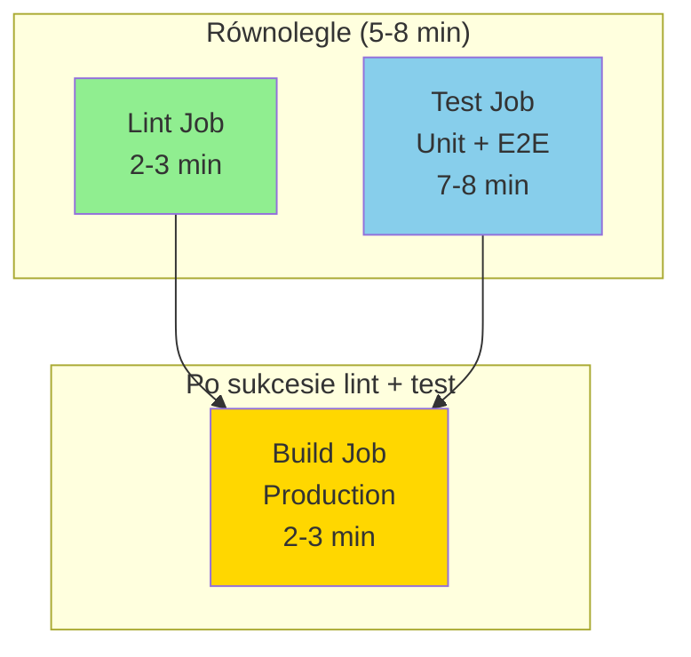

# CI/CD Configuration Guide

## Przegląd Pipeline

GitHub Actions workflow automatycznie wykonuje następujące joby przy każdym push/PR do `main`:



### Struktura Jobów

**1. Lint Job (2-3 min)** 🟢
- Walidacja kodu (oxlint + eslint)
- Uruchamia się równolegle z Test Job
- Timeout: 5 minut

**2. Test Job (7-8 min)** 🔵
- Unit tests z coverage (Vitest)
- E2E tests (Playwright)
- Upload coverage i playwright reports
- Uruchamia się równolegle z Lint Job
- Timeout: 15 minut

**3. Build Job (2-3 min)** 🟡
- Production build (astro check + build)
- Upload build artifacts
- **Wymaga:** Sukces lint + test
- Timeout: 10 minut

**Total time:** ~8-10 minut (równoległe wykonanie)

## Konfiguracja GitHub Secrets

### Wymagane Sekrety

Workflow wymaga następujących secrets w GitHub Repository:

```
Settings → Secrets and variables → Actions → New repository secret
```

| Secret | Opis | Jak uzyskać |
|--------|------|-------------|
| `PUBLIC_SUPABASE_URL` | URL projektu Supabase | Dashboard → Project Settings → API |
| `PUBLIC_SUPABASE_KEY` | Anon/Public API Key | Dashboard → Project Settings → API |
| `E2E_USERNAME` | Email użytkownika testowego | Dashboard → Authentication → Users → Create |
| `E2E_PASSWORD` | Hasło użytkownika testowego | Ustaw podczas tworzenia użytkownika |
| `E2E_USERNAME_ID` | UUID użytkownika | Dashboard → Authentication → Users → User ID |

### Krok po kroku: Tworzenie użytkownika E2E

1. Zaloguj się do [Supabase Dashboard](https://supabase.com/dashboard)
2. Wybierz swój projekt
3. Przejdź do `Authentication` → `Users`
4. Kliknij `Add user` → `Create new user`
5. Wprowadź:
   - Email: `e2e-test@yourdomain.com`
   - Password: Silne hasło (min. 8 znaków)
   - ✅ Auto Confirm User
6. Skopiuj UUID użytkownika (widoczne w liście użytkowników)
7. Dodaj wszystkie dane jako GitHub Secrets

## Lokalna Konfiguracja Testów

Aby uruchomić testy E2E lokalnie, utwórz plik `.env.test` w głównym katalogu projektu:

```bash
# .env.test
PUBLIC_SUPABASE_URL=https://xxxxx.supabase.co
PUBLIC_SUPABASE_KEY=eyJhbGciOiJIUzI1NiIsInR5cCI6IkpXVCJ9...
E2E_USERNAME=e2e-test@example.com
E2E_PASSWORD=YourSecureTestPassword123!
E2E_USERNAME_ID=123e4567-e89b-12d3-a456-426614174000

# Opcjonalne:
# SKIP_TEARDOWN=false  # Pomija czyszczenie danych po testach
# DEBUG=true           # Włącza szczegółowe logi
```

**⚠️ Ważne:** Plik `.env.test` jest w `.gitignore` i **NIE POWINIEN** być commitowany!

## Uruchamianie Testów Lokalnie

```bash
# Testy jednostkowe
npm run test:unit

# Testy jednostkowe z coverage
npm run test:unit:coverage

# Testy E2E (wymaga .env.test)
npm run test:e2e

# Testy E2E z UI
npm run test:e2e:ui

# Wszystkie kroki CI lokalnie
npm run lint
npm run test:unit:coverage
npm run test:e2e
npm run build
```

## Artefakty Pipeline

### 1. Coverage Report
- **Upload:** Zawsze (nawet przy niepowodzeniu)
- **Retencja:** 30 dni
- **Lokalizacja:** `Actions` → `Workflow run` → `Artifacts` → `coverage-report`
- **Zawartość:** HTML report z pokryciem kodu

### 2. Playwright Report
- **Upload:** Tylko przy niepowodzeniu testów E2E
- **Retencja:** 30 dni
- **Lokalizacja:** `Actions` → `Workflow run` → `Artifacts` → `playwright-report`
- **Zawartość:** Screenshoty, video, trace nieudanych testów

### 3. Production Build
- **Upload:** Tylko przy sukcesie
- **Retencja:** 7 dni
- **Lokalizacja:** `Actions` → `Workflow run` → `Artifacts` → `production-build`
- **Zawartość:** Folder `dist/` gotowy do deploy

## Troubleshooting

### Problem: E2E tests failing - Authentication error

**Objawy:**
```
Failed to sign in teardown user: Invalid login credentials
```

**Rozwiązanie:**
1. Zweryfikuj że sekrety `E2E_USERNAME` i `E2E_PASSWORD` są poprawne
2. Sprawdź czy użytkownik jest aktywny w Supabase Dashboard
3. Upewnij się że użytkownik został auto-confirmed

### Problem: E2E tests failing - User ID mismatch

**Objawy:**
```
Authenticated Supabase user (xxx) does not match E2E_USERNAME_ID (yyy)
```

**Rozwiązanie:**
1. Sprawdź UUID użytkownika w Supabase Dashboard
2. Zaktualizuj secret `E2E_USERNAME_ID` z poprawnym UUID

### Problem: Build failing - Type errors

**Objawy:**
```
Error: astro check failed
```

**Rozwiązanie:**
1. Uruchom lokalnie `npm run build`
2. Napraw błędy TypeScript
3. Commit i push zmian

### Problem: Playwright installation timeout

**Objawy:**
```
Error: Failed to install browsers
```

**Rozwiązanie:**
1. Sprawdź czy timeout workflow (20 min) nie jest za krótki
2. Zwiększ timeout w `.github/workflows/test.yml` jeśli potrzeba
3. Pipeline instaluje tylko Chromium - najlżejsza opcja

## Konfiguracja Workflow

### Timeout per Job

```yaml
lint:    timeout-minutes: 5   # Szybka walidacja
test:    timeout-minutes: 15  # Unit + E2E tests
build:   timeout-minutes: 10  # Production build
```

**Total pipeline time:** ~8-10 minut (dzięki równoległemu wykonaniu lint + test)

### Job Dependencies

```yaml
build:
  needs: [lint, test]  # Build wykonuje się tylko jeśli oba sukces
```

Jeśli **lint** failuje (2 min), oszczędzasz czas - nie trzeba czekać na build.
Jeśli **test** failuje (8 min), build nie wykona się - oszczędność czasu i resources.

### Retry Strategy (E2E)

```yaml
retries: process.env.CI ? 2 : 0  # 2 retry na CI, 0 lokalnie
```

Playwright automatycznie powtarza nieudane testy 2 razy na CI dla stabilności.

### Workers (E2E)

```yaml
workers: process.env.CI ? 1 : undefined  # 1 worker na CI
```

Na CI używamy pojedynczego worker dla:
- Stabilności (unikamy race conditions)
- Przewidywalności zasobów Supabase
- Lepszych logów (sekwencyjne wykonanie)

## Ręczne Uruchomienie Workflow

1. Przejdź do `Actions` tab w GitHub
2. Wybierz `Testing CI` workflow
3. Kliknij `Run workflow` dropdown
4. Wybierz branch (domyślnie `main`)
5. Kliknij `Run workflow`

## Monitoring i Optymalizacja

### Metryki do śledzenia

- **Total pipeline time:** Powinien być ~8-10 min (max 15 min)
- **Lint job:** < 3 min (typowo 2 min)
- **Test job:** < 10 min (typowo 7-8 min)
- **Build job:** < 5 min (typowo 2-3 min)
- **Flaky tests:** Testy które okresowo failują - wymagają fix
- **Coverage:** Cel > 70% dla unit tests
- **Build size:** Monitoruj rozmiar `dist/` artifacts

### Zalety obecnej struktury (3 joby)

✅ **Szybszy feedback** - Lint failuje w 2-3 min zamiast czekać 10+ min  
✅ **Równoległość** - Lint i Test działają jednocześnie  
✅ **Oszczędność zasobów** - Build nie wykonuje się jeśli lint/test failują  
✅ **Lepsze UI** - Osobny status dla każdego etapu w GitHub  
✅ **Selective re-run** - Możesz powtórzyć tylko failed job

### Best Practices

1. **Utrzymuj testy stabilne:** Unikaj flaky tests
2. **Szybkie feedback:** Optymalizuj czas testów
3. **Meaningful coverage:** Nie tylko % ale jakość testów
4. **Clean secrets:** Regularnie rotuj credentials E2E usera
5. **Monitor artifacts:** Usuwaj stare artifacts jeśli nie są potrzebne

## Next Steps

Po skonfigurowaniu CI/CD:

1. ✅ Dodaj badge statusu do README.md
2. ✅ Skonfiguruj branch protection rules (require CI pass)
3. ✅ Rozważ deployment workflow (CD)
4. ✅ Dodaj notification (Slack/Email) dla failed builds

## Dodawanie Badge do README

```markdown
[](https://github.com/YOUR_USERNAME/YOUR_REPO/actions/workflows/test.yml)
```

Zamień `YOUR_USERNAME` i `YOUR_REPO` na swoje wartości.

